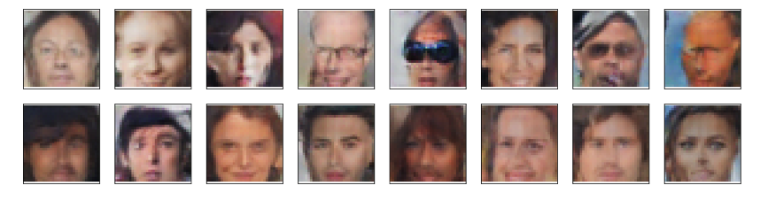

# Generate_Faces
Use generative adversarial networks (GANs) to generate new images of faces.

## Introduction
Imagine that you work for a production company. You job is to design the characters in a moive. You could definitely draw 
a bunch of different concepts and arrive at the final design by your own . But you could also just have a generative adversarial 
networks (GANs) do it for you. In this project, I aim to generate new faces using celebrity images.

## Required Skills
* Python
* Pytorch
* Data processing
* Understanding of GANs
* Understanding of hyperparameters and intuitions of tuning each hyperparameter 

## Demo 
### These are the faces generated my GANs...
 

:rocket::rocket::rocket:
Cheers:+1:
